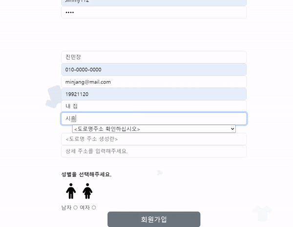
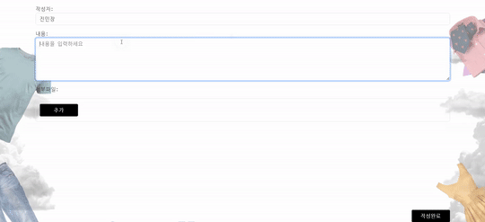
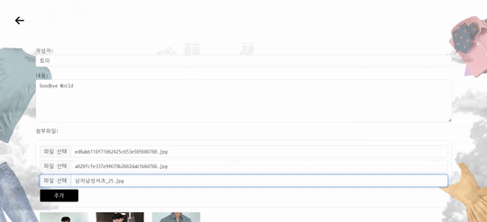

# NullBrainException
디지털 컨버전스 팀

### 목차
1. [개요](https://github.com/TheJimmyGod/NullBrainException?tab=readme-ov-file#%EA%B0%9C%EC%9A%94)
2. [팀원](https://github.com/TheJimmyGod/NullBrainException?tab=readme-ov-file#%ED%8C%80%EC%9B%90)
3. [활용한 기술](https://github.com/TheJimmyGod/NullBrainException?tab=readme-ov-file#%ED%99%9C%EC%9A%A9%ED%95%9C-%EA%B8%B0%EC%88%A0)
4. [구현](https://github.com/TheJimmyGod/NullBrainException?tab=readme-ov-file#%EA%B5%AC%ED%98%84)
5. [발표영상](https://github.com/TheJimmyGod/NullBrainException?tab=readme-ov-file#%EB%B0%9C%ED%91%9C%EC%98%81%EC%83%81)
6. [교육기관](https://github.com/TheJimmyGod/NullBrainException?tab=readme-ov-file#%EA%B5%90%EC%9C%A1%EA%B8%B0%EA%B4%80)

### 개요
공공데이터와 커뮤니티를 활용한 옷 쇼핑몰 웹사이트는 직관적이고 편리한 웹 옷쇼핑을 위해서 사용자들이 다양한 옷을 조회 할 수 있고, 구매할 수 있으며, 자신만의 코디로 게시글을 작성하고 다른 사용자들과 소통할 수 있는 옷 쇼핑몰 웹 사이트입니다.

### 팀원
- 진민장(팀장)(본인)
  - 지속 가능한 배경화면 애니메이션 구현
  - 배송지 추가/수정 및 연락처 수정과 같은 회원정보 관리 구현
  - 슬라이드 쇼를 겸한 인스타그램 기반의 커뮤니티 구현
  - AJAX를 활용한 다른 계정과 공유가 가능한 좋아요 기능 구현
  - AJAX를 이용한 도로명주소 공공데이터 활용을 구현
  - AJAX를 활용한 페이징 구현 
  - Github 세팅 및 관리
    
- 신성태
  - 회원가입 구현
  - Spring Security를 활용한 Naver, 카카오톡, Google, 그리고 Facebook 등의 OAuth2 로그인 및 로그아웃 등을 구현 
  - 유저별 권한 설정 구현
  - 로그인 실패 및 성공 시 동작 구현
    
- 조창성
  - RestTemplate으로 외부의 API를 사용하여 데이터 수집
  - EC2 RDS를 활용한 배포
  - 상품 구매 및 취소 구현 카드 결제
  - API를 AJAX로 활용한 결제 구현
  - 상품 상세 페이지 및 카테고리 구현
    
- 한승욱
  - 회원 활성화/비활성화 관리 구현
  - 회원의 등급관리 구현
  - 상품 문의 구현
  - 상품 취소 문의 구현
  - 주문 처리 관리 구현
  - 관리자 페이지 구현
    
- 이가영
  - 장바구니 구현
  - 배송 조회 페이지 구현
  - 리뷰 페이지 구현
  - 주문 페이지 구현

### 활용한 기술
- Front-End
  - JavaScript, Ajax, HTML, CSS, Bootstrap, Thymeleaf, Tailwind, Slick
- Back-End
  - JAVA-17, Gradle, Spring Security, Spring Boot 3, Mybatis, Lombok, Validator
- ETC
  - EC2, RDS, POSTMAN, ERD Editor, jsoup, Trello, selenium-java, commons-csv, commons-lang3, commons-text
- Version control
  - Git, Github
    - https://github.com/TheJimmyGod/NullBrainException
      
### 구현
- ## AJAX를 활용한 도로명주소 자동입력기능
  - #### 소개
    - [도로명주소 자동입력기능 구상]
      - 유저들이 웹사이트를 이용할 때 불편함을 느끼지 않고 손쉽게 긴 주소를 기입할 수 있을까에 대한 생각으로 출발하였다.
    - 공공데이터 웹사이트로부터 가져온 도로명주소 API를 AJAX로 전달시 JSON 파일로 변환시키며 POST 방식으로 전달시켜서 도로명주소의 데이터들을 배열로 저장시킨다.
    - 유저가 만일 일정 키워드를 입력시에 얻어왔던 주소 데이터를 setTimeOut를 재귀함수처럼 이용하여 n초 마다 지난 데이터나 중복된 데이터를 소거하면서 읽어낸다.
    - 찾아낸 주소들은 selector로 등록하게 된다.
    - 예를 들면, 안산이라고 입력한다면 안산에 위치한 주소들이 보이게 되고, 내가 원하던 주소인 '안산천동로 1길 29' 식으로 나올 수가 있다.
    - 마침내 주소들의 값들이 등록된 selector에서 원하는 주소를 누르면, 바로 밑 상세주소에서 도로명주소가 지니고 있던 주소가 자동으로 기입하게 된다.
  - #### 시연
      
    
  - #### 어려웠던 점
    초기에 도로명주소 자동입력기능 구현하는데에 있어서 어려운 점을 지니고 있었는데, 바로 유저가 주소를 잘못썼다는 것을 느꼈을 때 키워드를 바꿔서 주소를 기입시켜야 하는데, 키워드들로부터 삽입했었던 주소들의 데이터가 그대로 방치되어 있다는 점이다.    해당 구현은 setTimeOut이 재귀함수식으로 계속 실행시키면서 키워드를 자동으로 탐색하고, 주소 배열에 입력하는 방식이였지만, 중복된 주소가 있을 수 있는 우려도 있었고, 원하지 않는 주소들이 담겨 있을 수 있는 문제점들을 가지고 있었다.    그래서 이 문제점을 해결하고자 검색하는 함수 내에서 previous 이라는 필드를 사용해서 이전 키워드와 일치하면 탐색을 중단시키고, 조금이라도 일치하지 않는다면 이전의 탐색값들을 비우게 하고 바로 탐색을 진행시키게 하는 것이다.   이로 인해서 중복 현상과 부조화된 검색을 방지시킬 수가 있었고, 현재의 도로명주소 자동입력기능을 완성시킬 수가 있었다.  
  - 참조: [도로명주소 API 웹사이트] https://business.juso.go.kr/addrlink/openApi/apiExprn.do
- ## 인스타그램 기반의 게시글과 좋아요 기능
  - #### 소개
    - [게시글 구상]
      - 게시글은 제목을 눌러서 들어가는 일반적인 형식이 아닌 다른 방법으로 할 수 있지 않을까 를 출발점으로 구상하였고 인스타그램처럼 사람들이 자신이 입은 패션 사진들을 슬라이드쇼 처럼 넘기고, 댓글과 좋아요를 사용할 수 있도록 구조를 짜게 되었다.
    - 게시글은 내용을 넣고, 사진들을 버튼을 추가하면서 넣을 수 있도록 기능을 구현하였다. 추가 버튼을 누르면 그 안의 테이블에 새로운 Input 열이 추가되는 형식이다.
    - 게시된 글은 타인들이 볼 수가 있으며 좋아요나 댓글을 입력할 수 있고, 좋아요를 누를 시에 얼마나 좋아요를 찍었는가를 수집한다. 
  - #### 시연
      
    
    
  - #### 어려웠던 점
    처음으로 인스타그램으로 구현한다고 했을 때, 목록이 글 제목만 보여주는 것이 아닌 글의 디테일들을의 목록들을 어떻게 보여줘야 할까에 대한 고민이 많았었고, 이를 해결하기 위해 Thymeleaf의 기능 중 하나인 th:each를 충분히 활용해 게시글의 내용이나 업로드된 사진들이 잘 배치되는가를 낱낱이 확인하면서 구현을 하였다.  업로드된 사진들이 미리보기가 안 되고 깨지는 걸 알자, 왜 이럴까 근심을 가지다가, 이는 반드시 프로젝트에 설정된 yml의 upload 경로와 정확히해야 한다는 시행착오도 겪어 보고 해결을 하기도 했다.   좋아요 기능이 특히 어려웠는데, 단순 할 줄만 알았던 좋아요 버튼이 Controller, Repository, 그리고 Service단까지 거치고, ERD 관계에 있어서 유저와 게시글과 N:M이라는 관계임을 숙지를 하며 구현을 해야만 하는 것이다. 이를 잘 해결하기 위해서 ERD 테이블 관계를 고려를 해가며 SQL의 중간 테이블을 설정 잘 해놓고, MyBatis로 좋아요가 주입이 잘 되는가, 취소가 되는가, 그리고 전부 카운팅이 되는가 등등을 확인하면서 구현을 하였다.
- ## JQuery를 활용한 지속 가능한 애니메이션 구현
  - #### 소개
    - [지속 가능한 애니메이션 구상]
      - 지속 가능한 애니메이션을 구상하게 된 계기는 웹페이지의 디자인 공백이 드러나 있고, 이를 채워서 이용하는 고객들의 흥미가 돋굴 수 있도록 구현을 하게 다짐하였다.
    - 모든 애니메이션들은 FontAwesomeIcon 모델들을 토대로 제작 하였다.
    - 내려오거나, 올라오는 식으로 수 초마다 반복시키게 구현을 하였다.
    - JQuery를 이용하여 When 언제 시작해서, done 이동이 언제 끝나는지를 추적하고 다시 돌아오는 재귀형식으로 돌아오는 것이다.
  - #### 시연
      
    
  - #### 어려웠던 점
    애니메이션에 있어서 어려운 점은 JQuery의 when과 done의 작동이였다. 한 번은 이동 하는데 성공하다가도, 언제는 done이 작동이 안되서 모든 모델들이 제자리에서 멈추는 등, 시행착오를 여러 번 겪어 보았다. 게다가 배열을 통해서 이동과 재귀를 반복하기 때문에 모델이 배열에 잘 들어오고 작동하는가에 대한 판단도 요구되었다.
### 발표영상
[링크] https://youtu.be/kINpQCdb39Y?si=XrkEKK8qqNc1l9Rx

### 교육기관
[코리아IT아카데미] http://gangnam.koreaisacademy.com/
- 과정명: (디지털컨버전스) 공공데이터를 융합한 자바기반 Spring 웹개발자 양성과정
- 교육기간: 2024.03.26 ~ 2024.08.29 (총 832시간)
- 교육내용
  - JAVA 프로그래밍(128시간)
    - 기본문법, 객체지향 프로그래밍, 다형성, Collection, Exception, Inner class, IOStream, Stream, Lambda
  - RDBMS(40시간)
    - DML, DDL, DCL, 단일행/그룹함수, Join, SubQuery, View, 트랜잭션, ER-diagram, 정규화
  - 웹 표준(112시간)
    -  HTML 5 / CSS3 / JavaScript / jQuery / 반응형웹 / BootStrap / AJAX. fetch API / JSON / XML
  - GitHub(8시간)
  - Linux, AWS (24시간)
    - 배포, 자동재배포
  - 스프링 기반 웹 애플리케이션 프로젝트(160시간)
